# Report for Assignment 1

## Project chosen

Name: Zulip

URL: https://github.com/zulip/zulip.git

Number of lines of code and the tool used to count it: 6704686, counted with lizard

Programming language: Python (backend)

## Coverage measurement

### Existing tool

The repository already contained a coverage tool for developers to find files and functions and their respective coverage percentages. It is divided into several python executables, each targeting a specific area of the application.

Since we chose to analyze the backend, which is written almost completely in python, we used the script ./tools/test-backend —coverage, which generates a coverage report in HTML for better visual understanding, highlighting the covered and non-covered portions of the code. 

### Your own coverage tool

For each of the functions under 80% that we chose to instrumentalize, we added code to check for the coverage during testing, to see how it improved.

<The following is supposed to be repeated for each group member>

<Group member name>

<Function 1 name>

<Show a patch (diff) or a link to a commit made in your forked reposithttps://github.com/AbdullahBoraei/zulip/commit/05be9d7e7b741b07dfcfd6d894296ff9415b1aeaory that shows the instrumented code to gather coverage measurements>

<Provide a screenshot of the coverage results output by the instrumentation>

<Function 2 name>

<Provide the same kind of information provided for Function 1>

### Haileselassie Gaspar
  get_user_events()
  is_camo_url_valid()
  [commit](https://github.com/zulip/zulip/commit/8a1cf394537804103b9ab3ad69fed6404d470eff)
  

## Coverage improvement

### Individual tests

### Name: Haileselassie Gaspar

<Test 1>

[commit]( https://github.com/AbdullahBoraei/zulip/commit/4451942f004c323de6547e7460acf9f5ba3d2c23 )
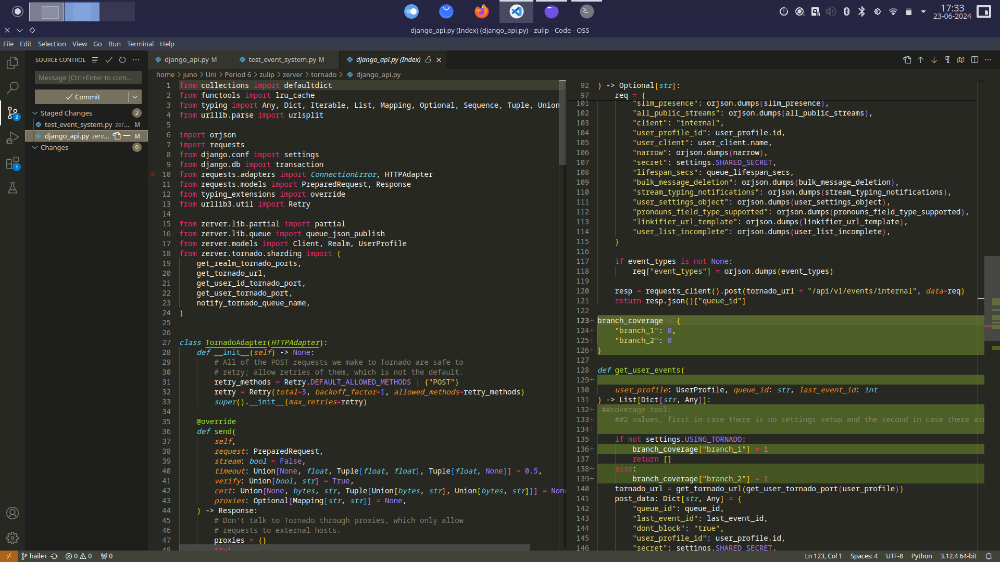

100% coverage improvement, by creating a new test for a full function.

<Test 2>

[commit](https://github.com/AbdullahBoraei/zulip/commit/05be9d7e7b741b07dfcfd6d894296ff9415b1aea)
100% coverage improvement, again because the function was not covered by any test.
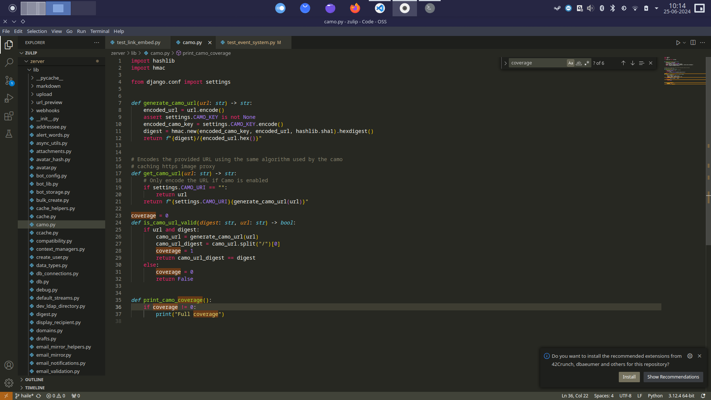
### Name: Atif

Function 1: get_plan_rate_percentage

commit: https://github.com/AbdullahBoraei/zulip/commit/ff89f290b3bed7915df3f18a520e97a176bd0f11

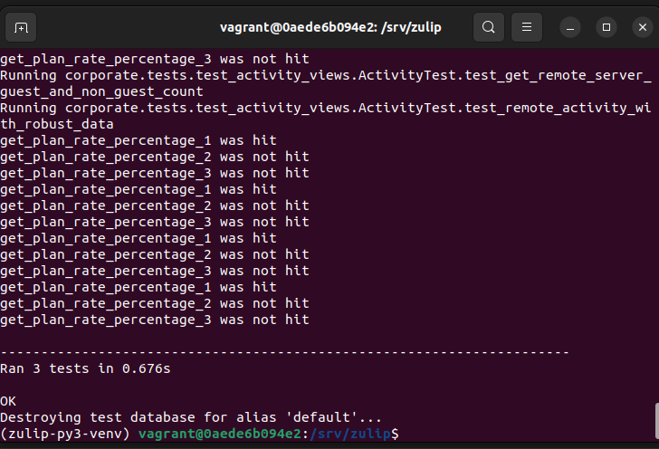

Function 2: display_list

commit: https://github.com/AbdullahBoraei/zulip/commit/08117ec1ce0c1f91762a36b5aac0714435f313ba

<Test 1>

commit: https://github.com/AbdullahBoraei/zulip/commit/ff89f290b3bed7915df3f18a520e97a176bd0f11
The test was accidentally included within the same commit as the instrumentation, that's why this link and the link for the commit from function 1 are the same.

The coverage went up from 33% to 100%. It was improved, because there wasn’t a dedicated test for the function at first. The old results were caused by the function being used for other tests, which explains why there wasn’t full coverage. 

<Test 2> 

Commit: https://github.com/AbdullahBoraei/zulip/commit/8498d7507576e9df0f15c7229970818d1ff9012b

The coverage went from 33% to 100%, the same as the previous function. Again, because there wasn’t a dedicated test for it.

### Abdullah Mohamed Elsayed Boraei

clear_analytics_tables.py

https://github.com/AbdullahBoraei/zulip/commit/11048771a165dbec1759f79ce0af739f886e2605
The link provides the commit which includes the changes made to both functions that were selected and altered. The first function being clear_analytics_tables and the second function being clear_single_stat.

Screenshot of coverage output of clear_analytics_tables:
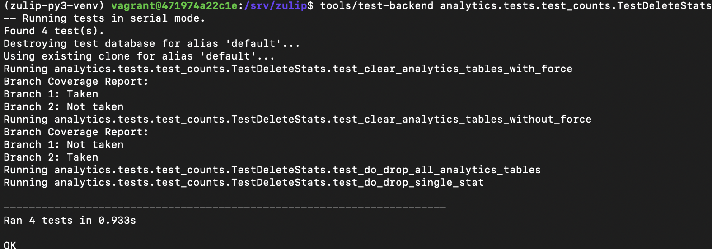

The first two tests were those that were made by me and tested the function clear_analytics tables. The following two tests were to test helper functions that were related to the function but did not specifically call upon the function and is the reason why there is no branch coverage report output to the command line.

clear_single_stat.py

https://github.com/AbdullahBoraei/zulip/commit/11048771a165dbec1759f79ce0af739f886e2605

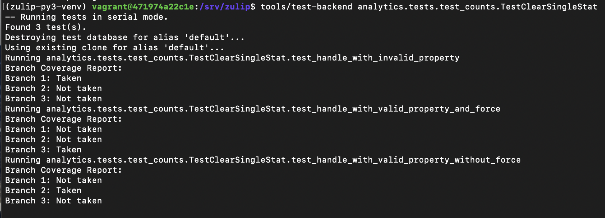
The function clear_single_stat did not have any tests previously, therefore, all the tests shown in the screenshot of the command line were made by me. The branch coverage report for each test shows which branch was taken in the specific case.

## Coverage improvement

### Individual tests

clear_analytics_tables_with_force and clear_analytics_tables_without_force

https://github.com/AbdullahBoraei/zulip/commit/310093043374ef6b9de4acc09f7df1c8dd0bef7f

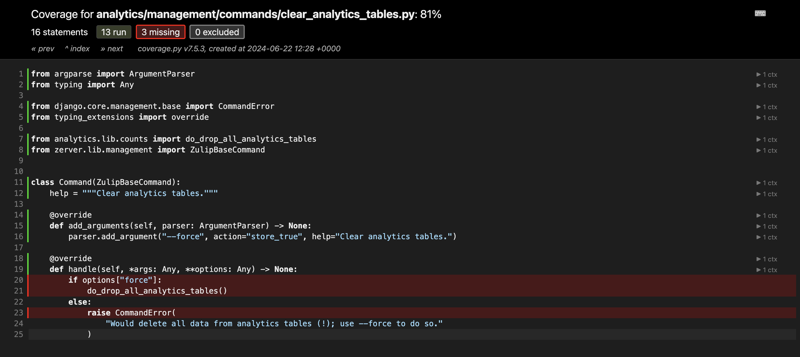

Function before instrumentation and test code implementation. 

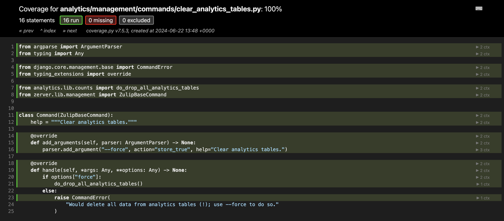

Function after the test implementation but before code instrumentation.

The original coverage according to the html file was 81%, however, there were no tests that tested the function. After the implementation of the tests, the coverage increased to 100%. The coverage improved because the tests that I had written ensured that the function itself was executed. The different paths/branches are called in each test that being “--force” or without “--force”. By writing tests that cover the different scenarios, more lines of code and more branches of conditional logic are executed.

ClearSingleStat test class

https://github.com/AbdullahBoraei/zulip/commit/310093043374ef6b9de4acc09f7df1c8dd0bef7f

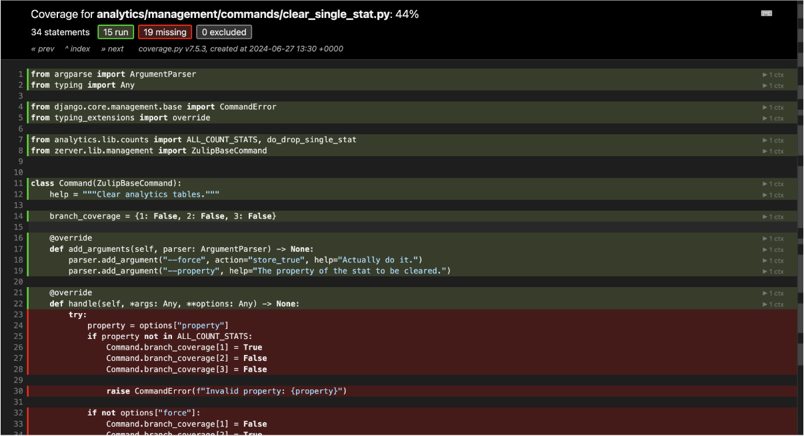
Function before test code implementation. 

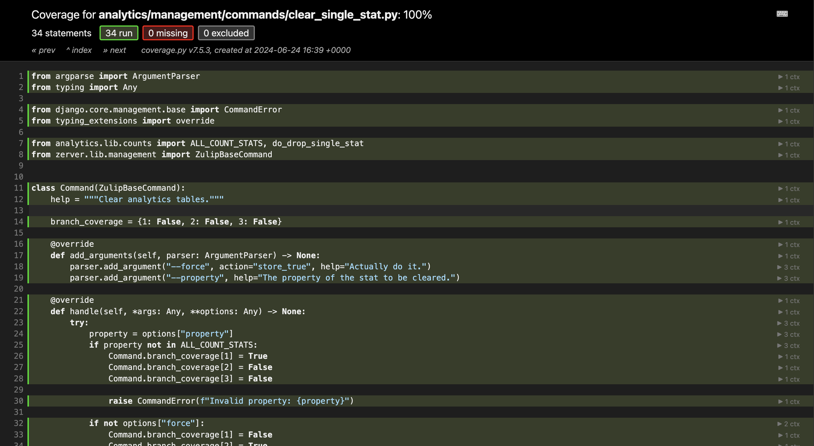
Function after the test implementation

The original coverage according to the html file was 44%%, however, there were no tests that tested the function. After the implementation of the tests, the coverage increased to 100%. The coverage improved because the tests that I had written ensured that the function itself was executed. The different paths/branches are called in each test being “--force”, “valid_property”, without “--force” or a combination of two. By writing tests that cover the different scenarios, more lines of code and more branches of conditional logic are executed.

### Overall

Overall Coverage Before Implementing Tests:

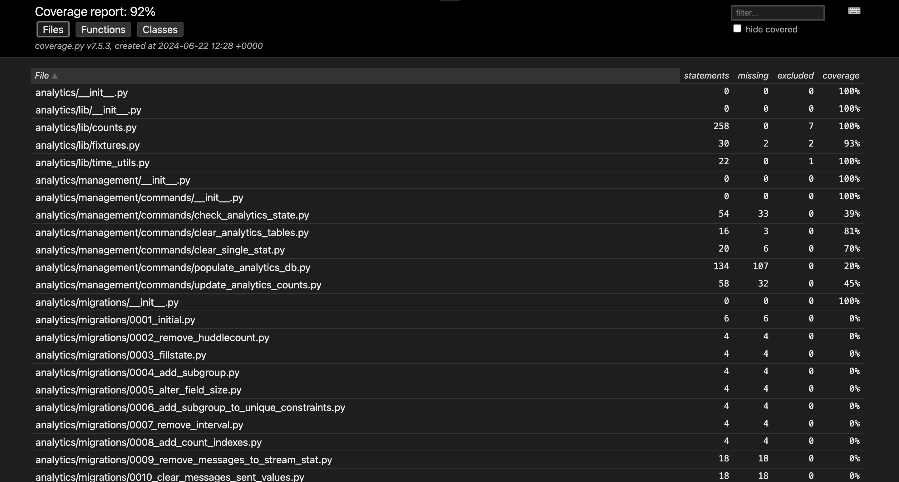

Overall Coverage After Implementing Tests:

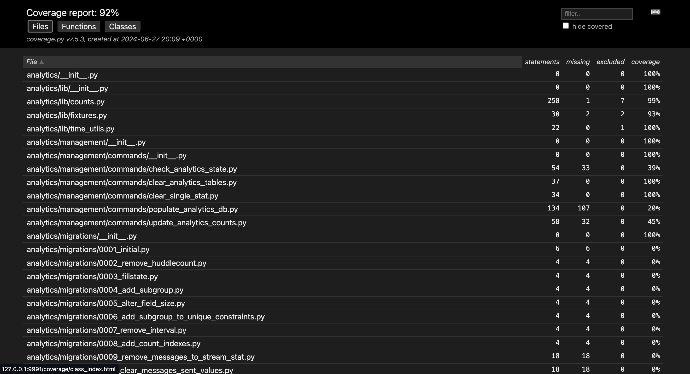

The overall code coverage did not increase as the number of functions that we tested or improved the tests of were miniscule compared to the overall size of the project and the coverage report does not show the decimals, however, as you can see from the screenshots, the coverage of the two files that Abdullah worked on have increased. There are some differences compared to the screenshots in the explanation above as the overall coverage report was done after code instrumentation, therefore, the NLOC in the files was different.

## Statement of individual contributions

Haileselassie Gaspar: Setup the coverage for get_user_events and is_camo_url_valid, as well as implemented a new test for both.

Abdullah Mohamed Elsayed Boraei: Setup the branch coverage report output to the command line for clear_analytics_tables.py and clear_single_stat.py, and implemented tests to ensure all branches are reachable and work as intended.
